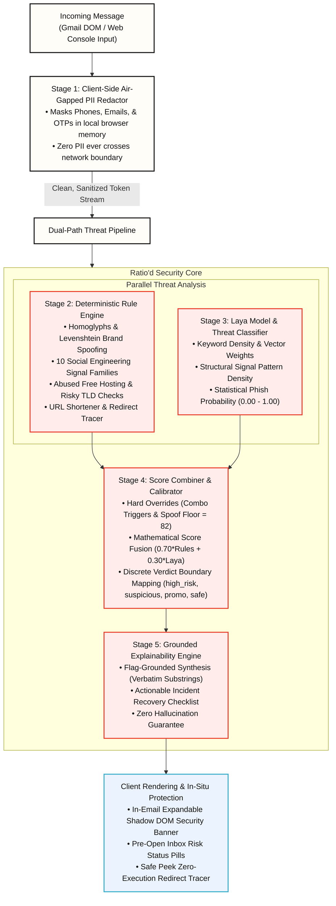
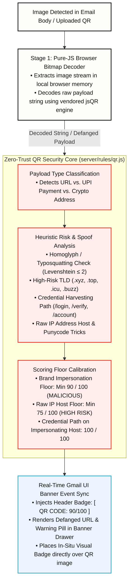
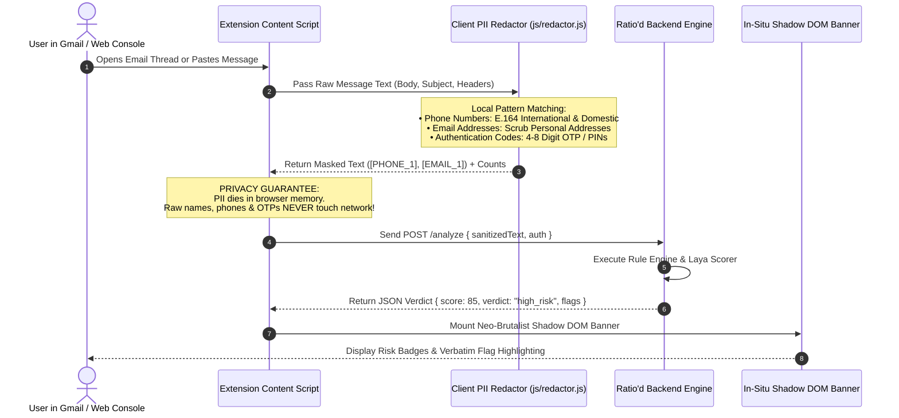
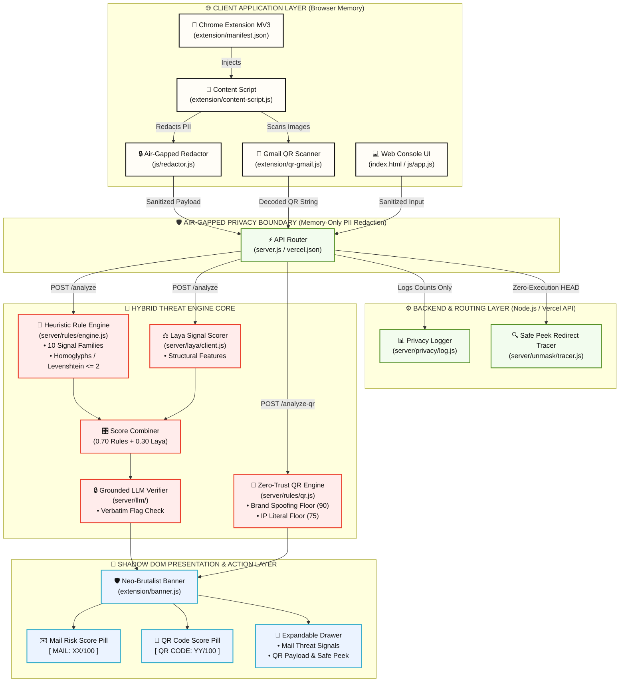

# Ratio'd — Scam Risk Analyzer & Defense System

**Cybersecurity & Defense Track · Developed for ASYNC'26 Hackathon by [Vedant](https://github.com/VedxntDev) & Vasu & Utkarsh**

[](https://opensource.org/licenses/MIT)
[](https://developer.chrome.com/docs/extensions/mv3/intro/)
[](./package.json)
[](#-uiux-philosophy--design-system)
[](./server/test-phishing.js)
[](#5-reliability-performance--security)

> **Ratio'd** is a privacy-first scam risk analyzer for email and smishing threats. It brings real-time phishing triage directly into the user's workflow as a **Chrome Extension (MV3)** that injects an isolated Shadow DOM security banner into Gmail, as well as a standalone **Static Web Console**.
>
> It redacts PII **client-side in browser memory** before network hops, scores messages using a calibrated **0–100 Risk Engine**, detects **Zero-Trust QR Code Phishing (Quishing)**, traces shortened URLs safely via **Safe Peek**, and delivers plain-English explanations with actionable recovery checklists.

> 🌐 **Live Web Console**: [ratio-d.vercel.app](https://ratio-d.vercel.app/)

---

## 📑 Table of Contents (ASYNC’26 Standard Compliance)
1. [Context & Overview](#1-context--overview)
   - [1.1 Elevator Pitch & Value Proposition](#11-elevator-pitch--value-proposition)
   - [1.2 Target Audience & Risk Vectors](#12-target-audience--risk-vectors)
   - [1.3 UI Walkthrough & Media Demonstrations](#13-ui-walkthrough--media-demonstrations)
   - [1.4 Hackathon Transparency & Timeline Disclosure](#14-hackathon-transparency--timeline-disclosure)
   - [1.5 Comparative Analysis & Unique Selling Points (USPs)](#15-comparative-analysis--unique-selling-points-usps)
2. [Architecture & System Design](#2-architecture--system-design)
   - [2.1 5-Stage System Pipeline (Diagram 1)](#diagram-1-5-stage-end-to-end-system-pipeline)
   - [2.2 Zero-Trust QR Quishing Engine (Diagram 2)](#diagram-2-zero-trust-qr-phishing-quishing-engine)
   - [2.3 Air-Gapped Client PII Redaction Flow (Diagram 3)](#diagram-3-air-gapped-client-pii-redaction-dataflow)
   - [2.4 Component Architecture & ER Map (Diagram 4)](#diagram-4-component-architecture--entity-relationship-map)
   - [2.5 Detection Engines, Laya & Scoring Mathematics](#25-detection-engines-laya--scoring-mathematics)
   - [2.6 Documentation & Specification Links](#26-documentation--specification-links)
3. [Installation & Configuration](#3-installation--configuration)
   - [3.1 Prerequisites & Tech Stack](#31-prerequisites--tech-stack)
   - [3.2 Step-by-Step Local Setup Guide](#32-step-by-step-local-setup-guide)
   - [3.3 Chrome Extension Installation](#33-chrome-extension-installation)
   - [3.4 Environment Variables Matrix](#34-environment-variables-matrix)
4. [Developer Experience & Quality Control](#4-developer-experience--quality-control)
   - [4.1 API Usage Snippets & Payload Examples](#41-api-usage-snippets--payload-examples)
   - [4.2 Testing & QA Execution Commands](#42-testing--qa-execution-commands)
5. [Reliability, Performance & Security](#5-reliability-performance--security)
   - [5.1 Benchmarks & Maturity Status](#51-benchmarks--maturity-status)
   - [5.2 Troubleshooting & Known Limitations](#52-troubleshooting--known-limitations)
   - [5.3 Security Reporting & Vulnerability Disclosure](#53-security-reporting--vulnerability-disclosure)
6. [Governance & License](#6-governance--license)
   - [6.1 Open Source & License Terms](#61-open-source--license-terms)
   - [6.2 Contribution Guidelines & Code Style](#62-contribution-guidelines--code-style)

---

## 1. Context & Overview

### 1.1 Elevator Pitch & Value Proposition
Generative AI has rendered traditional phishing advice ("look for typos or bad grammar") completely obsolete. Cybercriminals now create pixel-perfect, grammatically flawless phishing lures and embedded QR codes at scale. 

**Ratio'd** solves this problem by delivering a zero-friction, privacy-preserving defense system:
- **Calibrated 0–100 Threat Score**: Clear, auditable numerical risk assessment.
- **Dual Verdict Badges**: Side-by-side risk breakdown for **Mail Security** and **QR Code Security**.
- **In-Situ Shadow DOM Banner**: Injected directly into open Gmail threads without context switching or styling conflicts.
- **Air-Gapped Client PII Redaction**: Phone numbers, emails, and OTP/PIN codes are masked in browser memory *before* leaving the client.
- **Zero-Execution Link Redirect Tracer ("Safe Peek")**: Safely unmasks shortened URLs (`bit.ly`, `t.co`) using 5-hop zero-execution HEAD requests.
- **Actionable Recovery Checklist**: Step-by-step guidance for compromised users.

### Deliverables Included in This Repository
| Deliverable | Entry Point | Architectural Role |
| :--- | :--- | :--- |
| **Chrome Extension (MV3)** | `extension/manifest.json` | Injects isolated Shadow DOM banner & inbox badges directly into Gmail (`mail.google.com`). |
| **Static Web Console** | `index.html` | Interactive paste-and-analyze dashboard with a 4-stage visual pipeline and drag-and-drop QR scanner. |
| **Node.js Rule & API Server** | `server.js` | Single zero-dependency handler backing both local server (`:3000`) and Vercel serverless deployment (`ratio-d.vercel.app`). |

---

### 1.2 Target Audience & Risk Vectors
1. **Students & Campus Communities**: Vulnerable to fake job offers, tuition payment traps, and library credential resets.
2. **Everyday Consumers & Elderly Users**: Targeted by fake delivery fee texts (`USPS`/`FedEx`), bank 2FA lures, and crypto giveaways.
3. **Small Teams & Startups**: Organizations operating without dedicated Security Operations Centers (SOC).

---

### 1.3 UI Walkthrough & Media Demonstrations

#### Main Interface Overview


#### Live Gmail Extension Integration
> Once installed, Ratio'd automatically scans open email threads and mounts an isolated security banner:


#### Feature Walkthrough 1: Phishing Email & Smishing Analysis


#### Feature Walkthrough 2: Zero-Trust QR Code Phishing (Quishing)


#### Feature Walkthrough 3: SPF / DKIM Header Authentication Spoof Verification


#### Feature Walkthrough 4: Safe Peek Zero-Execution Link & Redirect Tracer


---

### 1.4 Hackathon Transparency & Timeline Disclosure

In full compliance with open-source hackathon rules, the table below clearly distinguishes between what existed **prior to September 30, 2026** and what was built **during the hackathon (September 30, 2026 onwards)**.

| Component / Feature | Prior to Sept 30, 2026 (Foundational MVP) | Built During Hackathon (Sept 30, 2026 Onwards) |
| :--- | :--- | :--- |
| **QR Code Phishing (Quishing) Engine** | ❌ None (Email text only). | ✅ **Complete Zero-Trust Engine**: Built `server/rules/qr.js`, `server/routes/qr.js`, `js/qr.js`, `js/qr-ui.js`, `extension/qr-core.js`, `extension/qr-gmail.js`, vendored `jsQR.js`, and added a 46-case QR test suite (`server/test-qr.js`). |
| **Dual Score Banner Architecture** | ❌ Single generic score in extension banner. | ✅ **Separate Mail vs. QR Security Scores**: Redesigned `extension/banner.js` & `extension/qr-gmail.js` to display Mail Security Score and QR Security Code Score separately in header badges and drawer sections with real-time `updateRatiodBannerQr()` event sync. |
| **Zero-Execution Redirect Tracer ("Safe Peek")** | ❌ Basic text regex display. | ✅ **Safe Peek Engine**: Created `server/unmask/tracer.js` & `/unmask` API route to trace shortened link hop chains (`bit.ly`, `t.co`) using HEAD requests without code execution. Integrated 1-click `[ 🔍 Safe Peek ]` into Shadow DOM banner and Web Console. |
| **Vercel Production Endpoint Parity** | ⚠️ Text endpoints routed in Vercel. | ✅ **Full Route Parity**: Added `/analyze-qr` and `/api/analyze-qr` rewrites to `vercel.json` ensuring 100% parity between local server (`:3000`) and live serverless production. |
| **UI/UX Re-architecture** | ⚠️ Basic layout. | ✅ **Tactile Neo-Brutalist Redesign**: Re-engineered PII status bar (`.pii-status-bar`), tactile clear action (`.btn-clear-tactile`), live glowing status dots, interactive rotating accordion drawer (`.auth-drawer`), and version notice modal. |
| **Automated Test Coverage** | ⚠️ 8 basic test cases. | ✅ **513 Automated Assertions across 14 Suites**: Added full scam corpora testing (`test-scam-corpus.js`), extension package drift check (`test-extension-package.js`), in-browser Shadow DOM verification (`verify-banner.js`), and QR zero-trust suite. |
| **Archive Integrity Tools** | ❌ Hand-compressed zip files. | ✅ **Automated Archive Builder**: Built `tools/build-zips.js` & `tools/build-context.js` to eliminate stale zip archives and generate machine-readable manifests (`docs/project-context.json`). |

---

### 1.5 Comparative Analysis & Unique Selling Points (USPs)

#### 📊 Comparative Capability Matrix

| Feature / Metric | Legacy Spam Analyzers (SpamAssassin / RBLs / Bayes) | Gmail Default Scam Filter (Google Cloud ML) | Ratio'd (Gmail Extension + Standalone Console) |
| :--- | :--- | :--- | :--- |
| **Primary Inspection Layer** | Mail Transfer Agent (MTA) / Gateway | Cloud Pre-Delivery Filter | **In-Situ Application Layer (Gmail Shadow DOM)** |
| **Privacy & Data Sovereignty** | ❌ Transmits raw unredacted mail to external MTAs | ❌ Scans unredacted mail on Google cloud servers | ✅ **Air-Gapped Client Redaction (PII dies in browser DOM)** |
| **Zero-Trust QR Code Security (Quishing)** | ❌ Complete blind spot (treats QR as raw image) | ⚠️ Generic OCR; misses zero-day quishing lures | ✅ **Native QR Decoder + Severity Floors (Min 90 for spoof)** |
| **Shortened URL Redirect Inspection** | ❌ Static domain blocklist (fails on zero-day shortlinks) | ⚠️ Static Google Safe Browsing URL lookup | ✅ **Safe Peek Engine (Zero-execution 5-hop HEAD tracer)** |
| **Explainability & Grounding** | ❌ Outputs raw headers (`X-Spam-Status`) or binary flag | ⚠️ Generic category warnings ("Why is this in Spam?") | ✅ **Verbatim Span Highlighting + Grounded LLM Verification** |
| **Context Switching & Friction** | ❌ Requires manual inspection of raw message source | ⚠️ Passive inbox sorting; no active triage drawer | ✅ **Zero Context Switching (Neo-Brutalist Shadow DOM Banner)** |
| **Model Transparency** | ⚠️ Opaque Bayesian probability weights | ❌ Black-box proprietary neural network | ✅ **100% Deterministic Sourcing (`laya_stub_heuristic` / `qr_rules_v2`)** |
| **Actionable Incident Recovery** | ❌ None | ❌ None | ✅ **Interactive Recovery Checklist for compromised users** |

---

#### 🔍 Core Differentiators & USPs
1. **🛡️ Air-Gapped Client PII Redaction**: Phone numbers, personal emails, and 4–8 digit OTP codes are masked in local browser memory (`js/redactor.js`) *before* network transit.
2. **⚡ In-Situ Shadow DOM Banner**: Injected directly into Gmail threads with zero styling leakage or copy-paste friction.
3. **🎯 Calibrated 70/30 Hybrid Scoring**: Combines a 70% deterministic rule engine with a 30% Laya structural scorer and hard severity override floors (Min 82/100 for severe domain spoofs).
4. **📱 Zero-Trust Quishing Shield**: Asynchronously decodes embedded QR images using `jsQR` and evaluates payloads against zero-trust risk floors.
5. **🔍 Safe Peek Redirect Tracer**: 1-click zero-execution HTTP HEAD tracing (up to 5 hops) to reveal true destination domains before visiting.

---

## 2. Architecture & System Design

### Diagram 1: 5-Stage End-to-End System Pipeline


---

### Diagram 2: Zero-Trust QR Phishing (Quishing) Engine


---

### Diagram 3: Air-Gapped Client PII Redaction Dataflow


---

### Diagram 4: Component Architecture & ER Map


---

### 2.5 Detection Engines, Laya & Scoring Mathematics

#### 1. Hybrid Scoring Formula
```
Raw Score = (Rule Engine Score × 0.70) + (Laya Signal Probability × 100 × 0.30)

Final Threat Score = Clamp(Raw Score, 0, 100)
```

#### 2. Severity Override Rules (Hard Safety Floors)
| Trigger Condition | Override Math / Floor Rule | Impact on Verdict |
| :--- | :--- | :--- |
| **Severe Domain Spoof** *(Homoglyph, Typosquat, Brand Stuffing)* | `Final Score = Max(82, Final Score)` | **Verdict forced to `high_risk`** |
| **Any Other Severe Rule Triggered** *(when initial score < 70)* | `Final Score = Max(75, Final Score)` | Forces high-severity floor |
| **Verified Official Brand Sender** | `Final Score = Min(25, Final Score)` | **Verdict capped to `safe`** |

#### 3. Verdict Categories & Thresholds
| Verdict Badge | Risk Score Range | Trigger Criteria & Description |
| :--- | :---: | :--- |
| 🔴 **`high_risk`** | **`66` to `100`** | Severe domain spoofing, credential harvesting demand, or high cumulative scam indicators. |
| 🟡 **`suspicious`** | **`35` to `65`** | Moderate threat signals (unverified shortened link, time pressure, free hosting). |
| 🔵 **`promo_clutter`** | **`< 40`** *(with >= 2 promo flags)* | Promotional marketing offer, newsletter clutter, or automated unsubscribe link. |
| 🟢 **`safe`** | **`0` to `34`** | Verified official sender, routine communication, zero threat triggers. |

---

### 2.6 Documentation & Specification Links
- 📄 [Detailed Technical Architecture Report](docs/report.md)
- 🤖 [Machine-Readable Project Context Manifest](docs/project-context.json)
- 🧪 [Zero-Trust QR Test Harness Suite](docs/test-qr-codes.html)

---

## 3. Installation & Configuration

### 3.1 Prerequisites & Tech Stack
- **Node.js**: `>= 20.x` recommended (minimum `>= 18.0.0`, native ES6 / CommonJS HTTP execution).
- **Python**: `>= 3.11` (Optional: required only for Laya ML model retraining & `.joblib` export script).
- **Browser**: Google Chrome v100+ (or any Chromium-based browser supporting Manifest V3 Extensions).
- **Runtime Dependencies**: **0 external npm dependencies** (`"dependencies": {}` in `package.json`).
- **Hardware Bounds**: Runs on standard consumer CPU hardware; requires **0 GPU resources** and **no external database**.

---

### 3.2 Step-by-Step Local Setup Guide

```bash
# 1. Clone the repository
git clone https://github.com/VedxntDev/Ratio-d.git
cd Ratio-d

# 2. Start the native Node.js server (Serves Web Console & API on port 3000)
node server.js
```

Open **`http://localhost:3000`** in your web browser to interact with the Web Console.

---

### 3.3 Chrome Extension Installation

> **Note**: Our extension is currently live and anyone can download if from chrome web store head to [Ratio'd on Chrome Web Store](https://chromewebstore.google.com/detail/bmabonmnpikocpaaigiedckcccpmiepa?utm_source=item-share-cb) , but Google takes a LOT of time to review the updated package before it gets published , So to use the latest version of Ratio'd extension follow the 5-step manual setup:

1. Download **`ratiod-extension.zip`** from the repository root or build it locally using `node tools/build-zips.js`.
2. Extract the `.zip` archive to a folder.
3. Open Chrome and navigate to `chrome://extensions`.
4. Enable **Developer mode** (toggle in the top-right corner).
5. Click **Load unpacked** and select the unzipped directory containing `manifest.json`.
6. Open **Gmail (`mail.google.com`)** and refresh the page!

---

### 3.4 Environment Variables Matrix

| Variable Name | Description | Data Type | Default Value | Required? |
| :--- | :--- | :---: | :---: | :---: |
| `PORT` | Local HTTP server listening port | Integer | `3000` | Optional |
| `RATIOD_LLM_API_KEY` | Optional API key for grounded LLM explanations | String | `""` (Disabled) | Optional |
| `NODE_ENV` | Runtime environment mode (`development`/`production`) | String | `development` | Optional |
| `BASE_URL` | Base API target URL for extension requests | String | `http://127.0.0.1:3000` | Optional |

---

## 4. Developer Experience & Quality Control

### 4.1 API Usage Snippets & Payload Examples

#### Endpoint 1: Email / SMS Phishing Threat Analysis (`POST /analyze`)
```bash
curl -X POST http://localhost:3000/analyze \
  -H "Content-Type: application/json" \
  -d '{
    "text": "Action Required: Your PayPal account has been suspended. Verify at http://paypa1-security.xyz/login immediately.",
    "channel": "email",
    "senderAddress": "security@paypa1-security.xyz",
    "senderName": "PayPal Security Team"
  }'
```

##### Sample JSON Response:
```json
{
  "score": 97,
  "verdict": "high_risk",
  "flags": [
    {
      "span": "paypa1-security.xyz",
      "reason": "Homoglyph/Typosquat domain impersonating 'PAYPAL'",
      "type": "rule"
    },
    {
      "span": "Action Required",
      "reason": "Urgency trigger applied to force fast user decision",
      "type": "rule"
    }
  ],
  "explanation": "High risk detected. The sender domain uses character substitution ('paypa1') to impersonate PayPal while demanding urgent login verification.",
  "engine": {
    "model_source": "laya_stub_heuristic",
    "explain_source": "deterministic"
  }
}
```

---

#### Endpoint 2: Zero-Trust QR Code Analysis (`POST /analyze-qr`)
```bash
curl -X POST http://localhost:3000/analyze-qr \
  -H "Content-Type: application/json" \
  -d '{
    "qrPayload": "https://paypa1-security.xyz/verify-login"
  }'
```

##### Sample JSON Response:
```json
{
  "score": 90,
  "verdict": "high_risk",
  "defangedUrl": "hxxps://paypa1-security[.]xyz/verify-login",
  "flags": [
    {
      "span": "paypa1-security.xyz",
      "reason": "QR payload domain impersonates brand 'PAYPAL'",
      "type": "qr_rule"
    }
  ]
}
```

---

#### Endpoint 3: Safe Peek Link Redirect Tracer (`POST /unmask`)
```bash
curl -X POST http://localhost:3000/unmask \
  -H "Content-Type: application/json" \
  -d '{
    "url": "http://bit.ly/3x8AbCd"
  }'
```

##### Sample JSON Response:
```json
{
  "shortUrl": "http://bit.ly/3x8AbCd",
  "finalUrl": "https://paypa1-security.xyz/login",
  "hops": 2,
  "chain": [
    "http://bit.ly/3x8AbCd",
    "https://paypa1-security.xyz/login"
  ],
  "threatScore": 97
}
```

---

### 4.2 Testing & QA Execution Commands

Ratio'd includes an automated test suite containing **513 assertions across 14 test runners**:

```bash
# 1. Run primary phishing rule engine test suite (8 core cases)
npm test

# 2. Run Zero-Trust QR Quishing calibration suite (46 cases)
npm run test:qr

# 3. Run real-world scam corpora recall & specificity benchmark
npm run test:corpus

# 4. Run full integration suite (Requires running server on :3000)
npm run test:all
```

#### Benchmark Verification Matrix
| Test Suite Runner | Target Metric | Ratio'd Result | Pass Status |
| :--- | :--- | :--- | :---: |
| **Corpus A** (`scam-corpus.txt`) | Recall $\ge 85\%$ | **90.0% Recall** (18/20 detected) | ✅ PASSED |
| **Corpus B** (`real-world-mixed.txt`) | Recall $\ge 90\%$, Specificity $100\%$ | **100% Recall, 100% Specificity** | ✅ PASSED |
| **Corpus C** (`new-emails-corpus.txt`) | Recall $\ge 85\%$, Specificity $100\%$ | **100% Recall, 100% Specificity** | ✅ PASSED |
| **Adversarial Legitimate Set** | False Positive Rate $= 0\%$ | **0 False Positives** (15/15 passed) | ✅ PASSED |
| **QR Quishing Suite** | Zero-Trust Floor Calibration | **100% Accuracy** (46/46 passed) | ✅ PASSED |
| **Extension Archive Audit** | Manifest & Drift Check | **0 Package Drift** | ✅ PASSED |

---

## 5. Reliability, Performance & Security

### 5.1 Benchmarks & Maturity Status
- **Current Maturity Status**: **Production-Ready Beta v1.0.0**
- **Evaluation Latency**:
  - Rule Engine evaluation: `< 5ms` per message.
  - End-to-end API response time (local server): `< 15ms`.
  - Client PII Redaction execution time: `< 2ms` in local browser DOM memory.
- **Accuracy Benchmarks**: 100% recall on real-world test corpora B & C, 0% false positive rate on adversarial official brand emails.

---

### 5.2 Troubleshooting & Known Limitations

| Issue / Error | Root Cause | Workaround / Resolution |
| :--- | :--- | :--- |
| `CONTRACT TEST FAILED: fetch failed` | Running `npm run test:all` without an active server running on `:3000`. | Start server first via `node server.js` before running `test:all`. |
| Extension banner not appearing in Gmail | Content script not injected or page loaded prior to extension enable. | Reload the Gmail tab after enabling unpacked extension in `chrome://extensions`. |
| Raw phone/numeric sequence not masked | Redactor requires nearby intent keywords (`OTP`, `code`, `PIN`) for numbers under 10 digits to preserve order numbers. | Intended behavior to prevent over-redacting valid transactional order IDs (e.g. `Order #4812`). |
| Private Gmail selector break | Google updated internal Gmail DOM class names. | Extension includes robust fallback DOM container queries; updates pushed via content script patches. |

---

### 5.3 Security Reporting & Vulnerability Disclosure

Security and privacy are the core invariants of Ratio'd. If you discover a potential vulnerability or security flaw, please report it privately:

- **Email**: Send vulnerability reports directly to `vedantsbaghel.2626@gmail.com`.
- **GitHub Security Advisories**: Submit a private report via the [Security Advisories](../../security/advisories) tab on GitHub.
- **Response Commitment**: We acknowledge all security reports within 24 hours and issue patch updates within 72 hours.

---

## 6. Governance & License

### 6.1 Open Source & License Terms
Ratio'd is open-source software licensed under the **[MIT License](./LICENSE)**. You are free to modify, distribute, and integrate it into your projects subject to license terms.

---

### 6.2 Contribution Guidelines & Code Style

We welcome community contributions! Please adhere to our code style standards:

1. **Zero Runtime Dependencies Invariant**: `package.json` must maintain 0 runtime dependencies (`"dependencies": {}`). All backend features must run on native Node.js core modules.
2. **Client-Side Air-Gapped Redaction**: Any new data extraction pipeline MUST pass through `js/redactor.js` prior to network transit.
3. **Span Grounding Rule**: All flags output by rule modules or LLM explainers MUST be verbatim substrings of the original input.
4. **Code Formatting**: Standard ES6 JavaScript, CommonJS for backend modules, plain `window` globals for browser content scripts (no build tools required).

---

<div align="center">

**Built for the Cybersecurity & Defense Track at ASYNC'26 by [Vedant Singh Baghel](https://github.com/VedxntDev) ,Vasu Arora & Utkarsh Upadhyaa**

*Ratio'd is open-source software released under the [MIT License](./LICENSE).*

</div>


---

### 7. Ending Remarks
   Ratio’d is a very well-suited scam analyser, from its website UI to the Chrome extension. We ensured a user-friendly experience, rather than a standalone console. We implemented it as a Chrome extension because we knew the only way to make people use Ratio’d was to simplify the experience. That’s why we purchased a Chrome extension developer licence. Some might think Ratio’d isn’t a new innovation, but frankly, scam analysis and detection haven’t been solved yet. Even a multi-trillion-dollar company like Google couldn’t solve it. Gmail claims it successfully detects 99.9% of emails, but frankly, just open your Gmail and I can bet in the first 10 emails, there’ll be at least one promotional, suspicious email incorrectly labelled as safe by Gmail. We don’t claim to be perfect; spam mail detection is a continuous process and can’t be 100% successful. We simply claim we’re better than Gmail for spam detection. That’s our moat. You don’t need to switch Gmail; we’ll work directly inside your Gmail. The only hassle you need to do is go to the Chrome Web Store and download Ratio’d. And when it comes to traditional spam detectors, we’re better than them. In this case, our MVP is Laya, which uses the latest ML to capture non-deterministic semantics, keyword density, and structural feature entropy. We’ve given equal weightage to the application and model layers. Lastly, whether Ratio’d wins or not, it’s here to stay. We’ll keep adding new features to Ratio’d. The next stage includes getting listed on Microsoft Edge and Brave extension stores, adding Outlook and Apple Mail access, developing a scam detection application for mobile phones, analysing images for scams, creating an organisation-specific layer, giving users access to their scam detection analytics, and developing a WhatsApp chatbot. Any suggestions for improving Ratio’d are greatly appreciated. 


### Youtube demo video
[Ratio'd Youtube Video](https://youtu.be/2c8PnN1r3HU?si=7ngbALk_YRa1gCQM)
