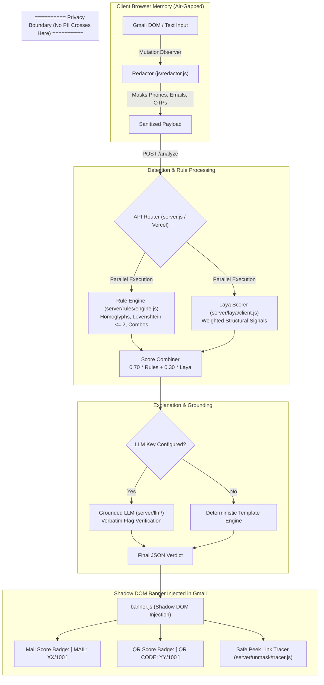
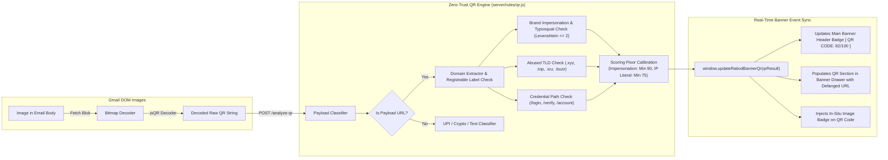
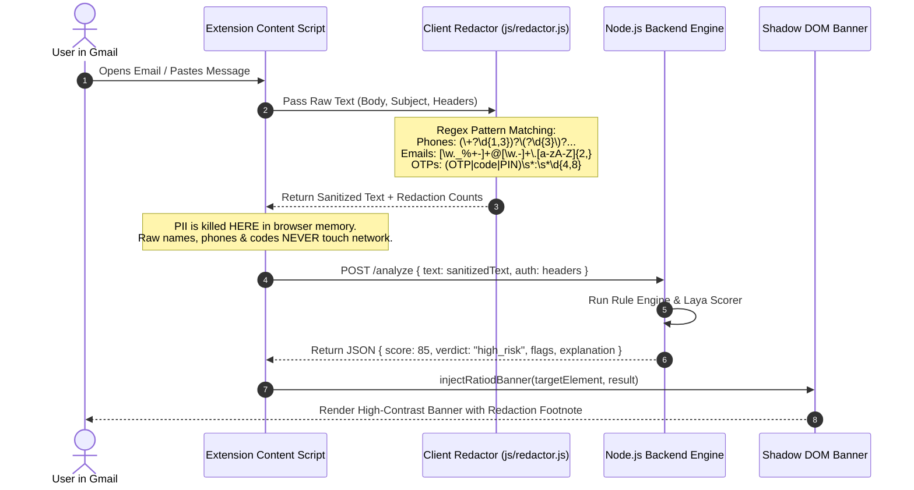

# Ratio'd — Scam Risk Analyzer & Defense System

**Cybersecurity & Defense Track · Developed for Hackathon by [Vedant](https://github.com/VedxntDev) & Vasu**

[](https://opensource.org/licenses/MIT)
[](https://developer.chrome.com/docs/extensions/mv3/intro/)
[](./package.json)
[](#-uiux-philosophy--design-system)
[](./server/test-phishing.js)

> **Ratio'd** is a privacy-first scam risk analyzer for emails and SMS messages. It brings phishing triage directly into the user's workflow as a **Chrome Extension (MV3)** that injects an isolated Shadow DOM security banner into Gmail, as well as a standalone **Static Web Console**.
>
> It redacts PII **client-side in browser memory** before network hops, scores messages using a calibrated **0–100 Risk Engine**, detects **Zero-Trust QR Code Phishing (Quishing)**, traces shortened URLs safely via **Safe Peek**, and delivers plain-English explanations with actionable recovery checklists.

---

## 📑 Table of Contents
1. [Executive Summary & Product Pitch](#-executive-summary--product-pitch)
2. [Why We Built It: The Generative AI Phishing Problem](#-why-we-built-it-the-generative-ai-phishing-problem)
3. [Application Layer & UX Philosophy](#-application-layer--ux-philosophy)
4. [Hackathon Transparency & Timeline Disclosure](#-hackathon-transparency--timeline-disclosure)
5. [Comparative Analysis: Ratio'd vs. Legacy Spam vs. Gmail Filters](#-comparative-analysis-ratiod-vs-legacy-spam-vs-gmail-filters)
6. [🔥 Unique Selling Points (USPs): Why Ratio'd is Built Different](#-unique-selling-points-usps-why-ratiod-is-built-different)
7. [System Architecture & Dataflow Diagrams](#-system-architecture--dataflow-diagrams)
8. [Under The Hood: 10-Stage Threat Pipeline](#-under-the-hood-10-stage-threat-pipeline)
9. [Detection Engines, Laya & Scoring Mathematics](#-detection-engines-laya--scoring-mathematics)
10. [Zero-Trust QR Phishing (Quishing) & Safe Peek Engine](#-zero-trust-qr-phishing-quishing--safe-peek-engine)
11. [Privacy & Security Invariants](#-privacy--security-invariants)
12. [Third-Party Disclosures, Dependencies & Licenses](#-third-party-disclosures-dependencies--licenses)
13. [Evaluation, Corpora & Verification Suite](#-evaluation-corpora--verification-suite)
14. [Installation & Setup Guide](#-installation--setup-guide)
15. [Repository Directory Structure](#-repository-directory-structure)
16. [Production Roadmap & Future Expansion](#-production-roadmap--future-expansion)

---

## 💡 Executive Summary & Product Pitch

### What It Is
Ratio'd is an intelligent cybersecurity triage system for email and smishing threats. Instead of outputting a binary "safe" or "unsafe" flag, Ratio'd delivers:
- **Calibrated 0–100 Risk Score**: Clear numerical threat breakdown.
- **Dual Verdict Badges**: Separate, side-by-side assessment for **Mail Security** and **QR Code Security**.
- **Shadow DOM In-Situ Banner**: Injected directly into Gmail messages without styling conflicts.
- **Zero-Execution Link Redirect Tracer ("Safe Peek")**: Safely inspects shortened URLs (`bit.ly`, `t.co`, `tinyurl`) via zero-execution HEAD chains.
- **Air-Gapped Client PII Redaction**: Phone numbers, email addresses, and OTP/PIN codes are masked in local browser memory before leaving the client.
- **Actionable Recovery Checklist**: Step-by-step guidance for users who may have already interacted with a suspicious message.

### Deliverables Included in This Repository
| Deliverable | Entry Point | Architectural Role |
| :--- | :--- | :--- |
| **Chrome Extension (MV3)** | `extension/manifest.json` | Injects isolated Shadow DOM banner & inbox badges directly into Gmail (`mail.google.com`). |
| **Static Web Console** | `index.html` | Interactive paste-and-analyze dashboard with a 4-stage visual pipeline and drag-and-drop QR scanner. |
| **Node.js Rule & API Server** | `server.js` | Single zero-dependency handler backing both local server (`:3000`) and Vercel serverless deployment (`ratio-d.vercel.app`). |

---

## 🛡️ Why We Built It: The Generative AI Phishing Problem

Traditional security advice trains users to watch for obvious typos, broken formatting, or awkward greetings. **Generative AI has rendered that advice obsolete.** Scammers now generate grammatically flawless, highly personalized phishing lures and smishing texts at massive scale.

```
TRADITIONAL ADVICE (OBSOLETE)         AI-GENERATED REALITY TODAY
─────────────────────────────         ──────────────────────────
• Poor spelling & grammar             • Flawless grammar & natural tone
• Generic "Dear Customer"             • Highly targeted context & names
• Obvious suspicious formatting       • Pixel-perfect brand styling
• Single malicious domain link        • Multi-stage redirects & QR codes (Quishing)
```

### Who Is Most at Risk?
1. **Students & Campus Communities**: Vulnerable to fake job offers, tuition fee scams, and campus library account resets.
2. **Everyday Consumers & Elderly Users**: Targeted by fake delivery fee texts (`USPS`/`FedEx`), bank verification lures, and crypto giveaway traps.
3. **Small Teams & Startups**: Organizations operating without dedicated Security Operations Centers (SOC).

Ratio'd bridges this gap by providing an instant, explainable second opinion right inside the user's inbox without requiring them to trust an external server with their private data.

---

## 🎨 Application Layer & UX Philosophy

### The "No Copy-Paste" Principle
> **Real users will not open a separate website to paste every suspicious email or SMS.** 

A security tool that requires context-switching introduces friction, and under friction, convenience wins over security. Ratio'd solves this by putting the **application layer directly inside Gmail**:

1. User opens an email in Gmail.
2. Ratio'd automatically scans headers, text, and embedded QR images.
3. A non-intrusive, neo-brutalist banner mounts at the top of the email.
4. Pre-open inbox pills appear in the thread list so users can gauge risk *before* opening dangerous attachments.

```
       USER WORKFLOW (CONVENIENCE FIRST)
       ┌─────────────────────────────────┐
       │     Opens email in Gmail        │
       └────────────────┬────────────────┘
                        │ (Automatic Content Script)
                        ▼
       ┌─────────────────────────────────┐
       │   Air-Gapped Client Redaction   │
       └────────────────┬────────────────┘
                        │ (Sanitized Payload)
                        ▼
       ┌─────────────────────────────────┐
       │  Ratio'd Shadow DOM Injected    │
       │  [ MAIL: 12/100 ] [ QR: 85/100 ]│
       └─────────────────────────────────┘
```

### Playful Neo-Brutalist Design System
Ratio'd abandons generic, sterile corporate UI in favor of a **Playful Neo-Brutalist** aesthetic:
- **Bold 2px–3px Solid Borders (`#121212`)** & Offset Drop Shadows (`3px 3px 0 #121212`).
- **Warm Cream Canvas (`#F6F1E7` / `#FFFDF7`)** paired with high-contrast accent stickers (`Coral Red #EA3E2B`, `Electric Yellow #FFD23F`, `Lime Green #9BE86D`, `Cyan #38AECC`).
- **Tactile Micro-Interactions**: Hover translations (`translate(-2px, -2px)`), active push-downs (`translate(2px, 2px)`), and rotating SVG indicators.
- **Monospaced Technical Typography (`JetBrains Mono`)** for codes, scores, and signals paired with `Plus Jakarta Sans` for headers.

---

## ⏱️ Hackathon Transparency & Timeline Disclosure

In full compliance with open-source hackathon rules, the table below clearly distinguishes between what existed **prior to September 30, 2026** and what was built **during the hackathon (September 30, 2026 onwards)**.

| Component / Feature | Prior to Sept 30, 2026 (Foundational MVP) | Built During Hackathon (Sept 30, 2026 Onwards) |
| :--- | :--- | :--- |
| **QR Code Phishing (Quishing) Engine** | ❌ None (Email text only). | ✅ **Complete Zero-Trust Engine**: Built `server/rules/qr.js`, `server/routes/qr.js`, `js/qr.js`, `js/qr-ui.js`, `extension/qr-core.js`, `extension/qr-gmail.js`, vendored `jsQR.js`, and added a 46-case QR test suite (`server/test-qr.js`). |
| **Dual Score Banner Architecture** | ❌ Single generic score in extension banner. | ✅ **Separate Mail vs. QR Security Scores**: Redesigned `extension/banner.js` & `extension/qr-gmail.js` to display Mail Security Score and QR Security Code Score separately in header badges and drawer sections with real-time `updateRatiodBannerQr()` event sync. |
| **Zero-Execution Redirect Tracer ("Safe Peek")** | ❌ Basic text regex display. | ✅ **Safe Peek Engine**: Created `server/unmask/tracer.js` & `/unmask` API route to trace shortened link hop chains (`bit.ly`, `t.co`) using HEAD requests without code execution. Integrated 1-click `[ 🔍 Safe Peek ]` into Shadow DOM banner and Web Console. |
| **Vercel Production Endpoint Parity** | ⚠️ Text endpoints routed in Vercel. | ✅ **Full Route Parity**: Added `/analyze-qr` and `/api/analyze-qr` rewrites to `vercel.json` ensuring 100% parity between local server (`:3000`) and live serverless production. |
| **UI/UX Re-architecture** | ⚠️ Basic layout. | ✅ **Tactile Neo-Brutalist Redesign**: Re-engineered PII status bar (`.pii-status-bar`), tactile clear action (`.btn-clear-tactile`), live glowing status dots, interactive rotating accordion drawer (`.auth-drawer`), and version notice modal. |
| **Automated Test Coverage** | ⚠️ 8 basic test cases. | ✅ **513 Automated Assertions across 14 Suites**: Added full scam corpora testing (`test-scam-corpus.js`), extension package drift check (`test-extension-package.js`), in-browser Shadow DOM verification (`verify-banner.js`), and QR zero-trust suite. |
| **Archive Integrity Tools** | ❌ Hand-compressed zip files. | ✅ **Automated Archive Builder**: Built `tools/build-zips.js` & `tools/build-context.js` to eliminate stale zip archives and generate machine-readable manifests (`docs/project-context.json`). |

---

## ⚔️ Comparative Analysis: Ratio'd vs. Legacy Spam vs. Gmail Filters

Security tools are often judged on accuracy alone, but in real-world defense, **where, when, and how security insights are presented** is what prevents human error. The comparative matrix and analytical breakdown below highlight why Ratio'd outperforms both traditional spam gateways and cloud-native email filters.

### 📊 Comparative Capability Matrix

| Feature / Metric | Legacy Spam Analyzers (SpamAssassin / RBLs / Bayes) | Gmail Default Scam Filter (Google Cloud ML) | Ratio'd (Gmail Extension + Standalone Console) |
| :--- | :--- | :--- | :--- |
| **Primary Inspection Layer** | Mail Transfer Agent (MTA) / Gateway | Cloud Pre-Delivery Filter | **In-Situ Application Layer (Gmail Shadow DOM)** |
| **Privacy & Data Sovereignty** | ❌ Transmits raw unredacted mail to external MTAs | ❌ Scans unredacted mail on Google cloud servers | ✅ **Air-Gapped Client Redaction (PII dies in browser DOM)** |
| **Zero-Trust QR Code Security (Quishing)** | ❌ Complete blind spot (treats QR as raw image) | ⚠️ Generic OCR; misses zero-day quishing lures | ✅ **Native QR Decoder + Severity Floors (Min 90 for spoof)** |
| **Shortened URL Redirect Inspection** | ❌ Static domain blocklist (fails on zero-day shortlinks) | ⚠️ Static Google Safe Browsing URL lookup | ✅ **Safe Peek Engine (Zero-execution 5-hop HEAD tracer)** |
| **Explainability & Grounding** | ❌ Outputs raw headers (`X-Spam-Status`) or binary flag | ⚠️ Generic category warnings ("Why is this in Spam?") | ✅ **Verbatim Span Highlighting + Grounded LLM Verification** |
| **Context Switching & Friction** | ❌ Requires manual inspection of raw message source | ⚠️ Passive inbox sorting; no active triage drawer | ✅ **Zero Context Switching (Neo-Brutalist Shadow DOM Banner)** |
| **Model Transparency** | ⚠️ Opaque Bayesian probability weights | ❌ Black-box proprietary neural network | ✅ **100% Deterministic Sourcing (`laya_stub_heuristic` / `qr_rules_v2`)** |
| **Actionable Incident Recovery** | ❌ None | ❌ None | ✅ **Interactive Recovery Checklist for compromised users** |

---

### 🔍 Deep Dive: Architectural Differentiators

#### 1. Gmail Default Filter vs. Ratio'd: The Gatekeeper Gap
Gmail's default spam filter operates **before delivery**. Its primary goal is inbox cleanup — sorting bulk spam into the Spam folder. 

- **The Failure Mode of Pre-Delivery Gatekeeping**: When a sophisticated spear-phishing email, homoglyph attack (`paypa1.com`), or QR code lure slips through Gmail's pre-delivery filter, **Gmail places it directly into the user's Inbox without any visual warning**. The user assumes that because it reached their Inbox, it is safe.
- **How Ratio'd Closes the Gap**: Ratio'd operates **at the point of consumption** (the active reading view). When the user opens an email, Ratio'd executes real-time header verification, Levenshtein distance checks, sender/reply-to mismatch analysis, and QR code image decoding, mounting a high-contrast Shadow DOM banner right above the email body.

#### 2. Legacy Spam Analyzers vs. Ratio'd: The Explainability & Privacy Void
Legacy tools like SpamAssassin or external web pastebins process raw, unredacted email text on server gateways.

- **The Privacy Risk**: Sending unredacted emails containing phone numbers, passwords, OTPs, and personal addresses across third-party networks creates massive data leak exposure.
- **The Explainability Void**: A user receiving a warning like `X-Spam-Score: 6.8 (BAYES_50, URIBL_BLACK)` has no idea *which specific sentence or domain* is dangerous.
- **How Ratio'd Solves Both**: Ratio'd redacts all PII in local browser memory before any API call is made. When threat flags are returned, Ratio'd highlights the **exact verbatim text span** inside the message body, giving the user immediate, plain-English proof of *why* the email was flagged.

---

## 🔥 Unique Selling Points (USPs): Why Ratio'd is Built Different

Ratio'd isn't just another email scanner — it is a paradigm shift in how individual users and teams defend against AI-generated phishing. Here are the 5 core pillars that set Ratio'd apart:

### 1. 🛡️ Air-Gapped Client PII Redaction (Privacy by Architectural Proof)
> **"What never leaves your browser can never be leaked."**
Most AI security tools require you to send your raw emails to their servers, forcing a choice between security and privacy. Ratio'd eliminates this tradeoff. Phone numbers, personal email addresses, and 4–8 digit OTP/PIN codes are masked in local browser memory (`js/redactor.js`) *before* the sanitized payload is sent to the scoring engine.

### 2. ⚡ In-Situ Shadow DOM Banner (Zero Friction, Zero Copy-Paste)
> **"Security that requires context-switching is security that users will skip."**
Copying email bodies into a separate web tool is too slow for daily email workflows. Ratio'd embeds directly into Gmail using a **CSS-isolated Shadow DOM container**. It injects live Mail Risk Badges (`[ MAIL: 12/100 ]`) and QR Code Badges (`[ QR CODE: 85/100 ]`) into opened threads and inbox list items without interfering with Gmail's native UI.

### 3. 🎯 Calibrated 70/30 Hybrid Scoring with Hard Severity Override Floors
> **"Deterministic precision where it matters, soft statistical intelligence where it counts."**
Pure AI models suffer from hallucinations and false positives; pure rule engines suffer from rigidity. Ratio'd combines a 70% deterministic rule engine with a 30% structural Laya scorer. Furthermore, severe domain spoofing (homoglyphs, typosquatting, display-name impersonation) automatically triggers **hard severity override floors** (min 82/100, forcing a `high_risk` verdict) regardless of how polite or convincing the email text appears.

### 4. 📱 Zero-Trust Quishing Shield (Native QR Image Scanning)
> **"Unmasking the QR code blind spot in modern email security."**
As text filters improve, cybercriminals increasingly replace link text with embedded QR code images to bypass traditional scanners. Ratio'd automatically scans email body images asynchronously using `jsQR`, decodes raw URLs, and runs them through a dedicated Zero-Trust QR Engine (`server/rules/qr.js`) that enforces hard risk floors (min 90/100 for typosquatted hosts, min 75/100 for raw IP hosts).

### 5. 🔍 Safe Peek: Zero-Execution Shortened Link Redirect Tracer
> **"Unmask shortened links before your browser touches them."**
Attackers hide malicious destinations behind link shorteners (`bit.ly`, `t.co`, `tinyurl`). Ratio'd's **Safe Peek Engine** enables 1-click zero-execution HTTP HEAD tracing (up to 5 hops) directly inside the Shadow DOM banner, revealing the final destination URL, domain age, and threat flags without executing client-side scripts.

---

## 🔄 System Architecture & Dataflow Diagrams

### Diagram 1: End-to-End System Pipeline


---

### Diagram 2: Zero-Trust QR Phishing (Quishing) Engine


---

### Diagram 3: Air-Gapped Client PII Redaction Dataflow


---

### Diagram 4: Eraser.io-Style Component Architecture & Entity Relationship Map
```mermaid
flowchart TD
    %% Eraser.io Architectural Layout for Ratio'd System
    classDef clientFill fill:#FFFDF7,stroke:#121212,stroke-width:2px,color:#121212
    classDef serverFill fill:#F2FCEE,stroke:#559127,stroke-width:2px,color:#121212
    classDef engineFill fill:#FFECEB,stroke:#EA3E2B,stroke-width:2px,color:#121212
    classDef renderFill fill:#EBF3FF,stroke:#38AECC,stroke-width:2px,color:#121212

    subgraph CLIENT_LAYER ["🌐 CLIENT APPLICATION LAYER (Browser / Gmail DOM)"]
        direction TB
        EXT["🧩 Chrome Extension MV3\n(extension/manifest.json)"] :::clientFill
        CS["📜 Content Script\n(extension/content-script.js)"] :::clientFill
        RED["🔒 Air-Gapped Redactor\n(js/redactor.js)"] :::clientFill
        QR_SCAN["📱 Gmail QR Scanner\n(extension/qr-gmail.js)"] :::clientFill
        WEB_APP["💻 Web Console UI\n(index.html / js/app.js)"] :::clientFill
        
        EXT -->|Injects| CS
        CS -->|Redacts PII| RED
        CS -->|Triggers| QR_SCAN
    end

    subgraph PRIVACY_WALL ["🛡️ AIR-GAPPED PRIVACY BOUNDARY (Memory-Only PII Redaction)"]
        RED -->|Sanitized Payload| API_GATEWAY
        QR_SCAN -->|Decoded QR String| API_GATEWAY
        WEB_APP -->|Sanitized Input| API_GATEWAY
    end

    subgraph SERVER_LAYER ["⚙️ BACKEND & ROUTING LAYER (Node.js / Vercel API)"]
        API_GATEWAY["⚡ API Router\n(server.js / vercel.json)"] :::serverFill
        LOG["📊 Privacy Logger\n(server/privacy/log.js)"] :::serverFill
        TRACER["🔍 Safe Peek Redirect Tracer\n(server/unmask/tracer.js)"] :::serverFill

        API_GATEWAY -->|Logs Counts Only| LOG
        API_GATEWAY -->|Zero-Execution HEAD| TRACER
    end

    subgraph DETECTION_CORE ["🧠 HYBRID THREAT ENGINE CORE"]
        RULE["📏 Heuristic Rule Engine\n(server/rules/engine.js)\n• 10 Signal Families\n• Homoglyphs / Levenshtein <= 2"] :::engineFill
        LAYA["⚖️ Laya Signal Scorer\n(server/laya/client.js)\n• Structural Features"] :::engineFill
        QR_RULES["📱 Zero-Trust QR Engine\n(server/rules/qr.js)\n• Brand Spoofing Floor (90)\n• IP Literal Floor (75)"] :::engineFill
        COMBINER["🎛️ Score Combiner\n(0.70 Rules + 0.30 Laya)"] :::engineFill
        GROUNDER["🔒 Grounded LLM Verifier\n(server/llm/)\n• Verbatim Flag Check"] :::engineFill

        API_GATEWAY -->|POST /analyze| RULE
        API_GATEWAY -->|POST /analyze| LAYA
        API_GATEWAY -->|POST /analyze-qr| QR_RULES

        RULE --> COMBINER
        LAYA --> COMBINER
        COMBINER --> GROUNDER
    end

    subgraph PRESENTATION ["🎨 SHADOW DOM PRESENTATION & ACTION LAYER"]
        BANNER["🛡️ Neo-Brutalist Banner\n(extension/banner.js)"] :::renderFill
        MAIL_BADGE["✉️ Mail Risk Score Pill\n[ MAIL: XX/100 ]"] :::renderFill
        QR_BADGE["📱 QR Code Score Pill\n[ QR CODE: YY/100 ]"] :::renderFill
        DRAWER["📂 Expandable Drawer\n• Mail Threat Signals\n• QR Payload & Safe Peek"] :::renderFill

        GROUNDER --> BANNER
        QR_RULES --> BANNER
        BANNER --> MAIL_BADGE
        BANNER --> QR_BADGE
        BANNER --> DRAWER
    end
```

#### Entity & Component Relationship Mapping
| Source Component | Relationship | Target Component | Protocol / Contract |
| :--- | :---: | :--- | :--- |
| **Chrome Extension MV3** | `INJECTS` | **Content Script** | Injects `content-script.js` & `banner.js` into `mail.google.com` at `document_idle`. |
| **Content Script** | `EXECUTES IN-MEMORY` | **Air-Gapped Redactor** | Redacts phone numbers, emails, and OTPs in local browser memory before any network hop. |
| **Content Script** | `TRIGGERS` | **Gmail QR Scanner** | Scans open email body images asynchronously for embedded QR codes. |
| **Content Script / Web App** | `REQUESTS` | **API Router** | Sends sanitized payload to `POST /analyze` (`server.js` / Vercel serverless). |
| **API Router** | `EVALUATES (70%)` | **Heuristic Rule Engine** | Evaluates 10 signal families, Levenshtein brand distance $\le 2$, and combinations. |
| **API Router** | `EVALUATES (30%)` | **Laya Signal Scorer** | Evaluates hand-weighted structural signals (`laya_stub_heuristic` or `laya_trained_v1`). |
| **API Router** | `EVALUATES QR` | **Zero-Trust QR Engine** | Evaluates decoded QR payload with strict severity floors (Min 90 for spoofing). |
| **API Router** | `EXECUTES HEAD` | **Safe Peek Tracer** | Traces shortened URLs (`bit.ly`, `t.co`) up to 5 hops without execution. |
| **Score Combiner** | `VERIFIES` | **Grounded LLM Verifier** | Verifies LLM explanations verbatim against source text ($temp = 0$). |
| **Threat Engine** | `MOUNTS` | **Shadow DOM Banner** | Injects Neo-Brutalist banner with dual score pills `[MAIL]` & `[QR CODE]`. |

---

## ⚙️ Detection Engines, Laya & Scoring Mathematics

### 1. Hybrid Scoring Formula
Ratio'd calculates an overall threat score ($S_{\text{raw}}$) by combining the deterministic Rule Engine ($R_{\text{score}}$) and the structural Laya Scorer ($P_{\text{signal}}$):

$$S_{\text{raw}} = \left( R_{\text{score}} \times 0.70 \right) + \left( P_{\text{signal}} \times 100 \times 0.30 \right)$$

$$S_{\text{final}} = \text{clamp}(S_{\text{raw}}, 0, 100)$$

---

### 2. Severity Override Rules
To ensure sophisticated domain spoofing cannot pass as safe due to polite wording, hard override floors apply:
- **Severe Domain Spoof** (Homoglyph / Typosquat / Brand Stuffing / Urgency + Credential demand):
  $$S_{\text{final}} = \max(82, S_{\text{final}}) \implies \text{Verdict forced to } \text{high\_risk}$$
- **Any Other Severe Rule Triggered** (when $S_{\text{final}} < 70$):
  $$S_{\text{final}} = \max(75, S_{\text{final}})$$
- **Official Brand Sender Cap**: If the sender domain is verified in `OFFICIAL_BRAND_DOMAINS` and no credential request exists:
  $$S_{\text{final}} = \min(25, S_{\text{final}}) \implies \text{Verdict capped to } \text{safe}$$

---

### 3. Verdict Categories
- `high_risk`: $S_{\text{final}} \ge 66$
- `suspicious`: $S_{\text{final}} \ge 35$
- `promo_clutter`: $\ge 2 \text{ promo signals and } S_{\text{final}} < 40$
- Else `safe`

---

### 4. Rule Engine Breakdown (`server/rules/engine.js`)

Per domain, three brand verification algorithms run:
1. **Homoglyph Substitution**: Character replacement check (e.g., `paypa1` $\to$ `paypal`, `m1crosoft` $\to$ `microsoft`). Dual normalization runs (`1` $\to$ `i` and `1` $\to$ `l`) so `paypa1` resolves properly.
2. **Brand Stuffing**: Brand name embedded inside an unauthorized domain (e.g., `paypal-security-update.xyz`).
3. **Levenshtein Distance**: Distance $\le 2$ against official brand database (length delta $\le 2$, brand length $\ge 4$).

#### 10 Social Engineering Families (Max 2 hits per family, 2nd hit at half value):
| Family | Points | Description |
| :--- | :--- | :--- |
| `advance_fee` | 20 pts | Small payment demanded to release funds/packages. |
| `refund_bait` | 18 pts | Overpayment or unsolicited refund claim. |
| `delivery_fee` | 20 pts | Invalid address or unpaid delivery fee lures (`USPS`/`FedEx`). |
| `fake_subscription` | 18 pts | Renewal invoice for unauthorized cloud antivirus/service. |
| `fake_security` | 20 pts | "Account suspended", "Unusual sign-in activity", or 2FA panic. |
| `investment` | 15 pts | Crypto giveaway or guaranteed high-yield returns. |
| `health_claim` | 15 pts | Unsubstantiated medical cure or banned lecture lure. |
| `personal_data` | 15 pts | Request for SSN, full birthdate, or banking details. |
| `contact_stranger` | 15 pts | Direct messaging request from unknown contact. |
| `inheritance` | 25 pts | Deceased estate or lottery fund transfer lure. |

#### Structural High-Risk Signal Combinations:
- **Reply-To $\neq$ From**: $+25$ pts (defeats reply-path filtering).
- **Mixed-Script Homoglyph**: $+30$ pts (Cyrillic/Greek character inside a Latin domain).
- **Sender on Free/Abuse Host**: $+20$ pts (`firebaseapp.com`, `weebly.com`, `wixsite.com`).
- **Display-Name Impersonation**: $+55$ pts (Brand name in display header vs throwaway sending domain).
- **Signature Footer Impersonation**: $+45$ pts (e.g., `© 2025 PayPal, LLC` sent from unverified address).
- **Urgency + Credential Harvesting Combo**: $+45$ pts.
- **Shortener + Time Pressure Combo**: $+30$ pts.

---

### 5. What is Laya & Why We Built It (`server/laya/`)

#### 🧠 What is Laya?
**Laya** (`server/laya/client.js` & `server/laya/inference.js`) is Ratio'd's **Structural Signal & Statistical Threat Engine**. It acts as a high-speed, zero-dependency contextual classifier that evaluates structural layout patterns, token density, and behavioral indicators in parallel with the deterministic Rule Engine.

Laya operates in a **Dual-Engine Architecture**:
1. **Trained ML Inference Mode (`laya_trained_v1`)**: When `trained_model.json` is present, Laya executes a pure JavaScript **Sublinear TF-IDF + L2 Normalized Logistic Regression Model** in native Node.js without requiring Python, C++ bindings, or external ONNX runtimes.
2. **Hand-Weighted Heuristic Fallback (`laya_stub_heuristic`)**: When running standalone, Laya executes a deterministic, auditable structural feature evaluator that scores high-precision signals (Punycode hosts, bare IP literals, data URIs, base64 blobs, credential/wire prompts, and multi-domain link farms).

#### 🎯 Why We Built Laya (The Architectural Rationale)
Rule engines and statistical models have complementary strengths and weaknesses. Building Ratio'd on either one alone would compromise security:

- **Why Rule Engines Alone Fail**: Deterministic rules are fast and 100% auditable, but they are binary. A message either triggers a rule or it doesn't. Sophisticated zero-day phishing lures that alter phrasing or use novel vocabulary can slip past static rules if no exact match exists.
- **Why Pure ML Models / LLMs Alone Fail**: Black-box ML models are prone to unpredictable false positives, latency penalties, and hallucinations. A model might flag a legitimate receipt simply because it contains financial vocabulary.
- **The Laya Synergy (30% Laya + 70% Rules)**: Laya supplies a continuous, soft probability gradient ($P_{\text{signal}}$) weighted at **30%** of the total score. It measures structural density (e.g., base64 payload size, link count to text ratio, urgency token frequency). The deterministic Rule Engine controls **70%** of the score and holds **hard override authority** (forcing $S_{\text{final}} \ge 82$ on severe domain spoofs).

#### 🛡️ Auditable Structural Signal Weights in Laya
| Signal Name | Weight | Technical Detection Condition | Security Rationale |
| :--- | :---: | :--- | :--- |
| `punycode_host` | $+0.34$ | `https?://[^\s/]*xn--` | Detects Internationalized Domain Name (IDN) homoglyph tricks designed to fool visually. |
| `ip_literal_link` | $+0.34$ | `https?://\d{1,3}(\.\d{1,3}){3}` | Legitimate services use registered domains; bare IP links hide hosting infrastructure. |
| `data_uri` | $+0.30$ | `data:(text/html\|application/javascript)` | Used to smuggle executable HTML/JS payloads past email gateway filters. |
| `base64_blob` | $+0.24$ | `[A-Za-z0-9+/]{120,}={0,2}` | Identifies obfuscated attachments, hidden redirects, or encoded inline scripts. |
| `credential_or_wire` | $+0.20$ | Keyword density (`verify/confirm account` or `gift card/bitcoin/wire`) | Identifies high-risk action demands combined with financial or auth pressure. |
| `link_farm` | $+0.18$ | $\ge 5$ distinct outbound domain hosts | Detects multi-redirect scam hubs disguised as complex emails. |

*Corroboration Damping*: To prevent multiple minor structural signals from over-inflating risk on complex legitimate newsletters, Laya applies a **damping factor of $-0.06$** for every structural signal beyond the second.

#### 💡 Source Transparency Invariant
Every response returned by `/analyze` explicitly includes `engine.model_source` (`laya_trained_v1` or `laya_stub_heuristic`). We **never** mask heuristic scoring as trained AI verdicts, ensuring 100% transparency for security auditors.

---

## 📱 Zero-Trust QR Phishing (Quishing) & Safe Peek Engine

### Zero-Trust QR Engine (`server/rules/qr.js`)
QR code phishing bypasses traditional email text filters because the malicious link is embedded inside an image. Ratio'd implements a zero-trust QR analysis engine:

1. **Payload Decoding**: Extracted via browser `createImageBitmap` and decoded using `jsQR.js`.
2. **URL Defanging**: Converts `https://paypa1-verify.xyz/login` into safe display text `hxxps://paypa1-verify[.]xyz/login`.
3. **Zero-Trust Calibration Floors**:
   - **Brand Impersonation / Typosquatting in QR**: Floor **90/100** (`MALICIOUS`).
   - **Credential Path (`/login`, `/verify`) on Impersonating QR Host**: Capped at **100/100**.
   - **Raw IP Address Host**: Floor **75/100** (`HIGH_RISK`).
   - **Punycode / Userinfo Tricks**: Floor **75/100** (`HIGH_RISK`).

---

### Safe Peek Zero-Execution Link Redirect Tracer (`server/unmask/tracer.js`)
Attackers hide destination domains behind link shorteners (`bit.ly`, `t.co`, `tinyurl.com`, `rb.gy`). **Safe Peek** allows users to inspect redirect chains safely:

```
USER CLICKS [ 🔍 Safe Peek ]
            │
            ▼
POST /unmask { url: "http://bit.ly/3x8..." }
            │
            ▼
Node Tracer performs zero-execution HTTP HEAD requests (Max 5 hops)
            │
            ▼
RETURNS: Hops: 2 → Final Destination: paypa1-security.xyz (Score: 97/100, HIGH RISK)
```

---

## 🔒 Privacy & Security Invariants

Ratio'd enforces 6 strict security invariants:

1. **Mandatory `escapeHtml()` on Banner Interpolation**:
   `flags[].span` is a raw slice of the email body and `explanation` can be LLM-written. All interpolations are escaped to prevent DOM-based XSS inside live Gmail sessions.
2. **Span Grounding & Verbatim Enforcement**:
   Flag spans must be verbatim substrings of the original input. The engine never invents evidence.
3. **Zero Data Persistence**:
   Message content is never saved to disk or database. Privacy logger (`server/privacy/log.js`) records counts only (`{ phones_masked: 1, emails_masked: 2, total_redactions: 3 }`).
4. **Path Traversal Protection**:
   Web server file resolver (`resolveWebFile`) rejects `..`, re-resolves paths, and enforces strict first-segment allowlisting.
5. **Minimal Extension Permissions**:
   Manifest V3 permissions are restricted to `activeTab` and `storage` only.
6. **Strict LLM Grounding Guard (`isGrounded()`)**:
   If an optional LLM explanation contains hallucinated flags not present in source text, the LLM response is discarded and replaced with a deterministic template.

---

## 📦 Third-Party Disclosures, Dependencies & Licenses

In strict adherence to hackathon rules, all external libraries, datasets, and frameworks used in Ratio'd are declared below with their respective open-source licenses:

| Asset / Dependency | Type / Module | Source / Origin | License | Usage Purpose in Ratio'd |
| :--- | :--- | :--- | :--- | :--- |
| **Node.js Core Modules** | Runtime Environment | `http`, `fs`, `path`, `crypto`, `url`, `tls` | MIT / Node.js | Server orchestration, HTTP API, and zero-dependency rule engine. |
| **jsQR.js** | Client Vendor Library | `js/vendor/jsQR.js` | Apache 2.0 | Pure JavaScript QR code image decoding in browser memory. |
| **Inter Font** | Typography Asset | Google Fonts | SIL Open Font License 1.1 | Clean body typography across Web Console and Extension banner. |
| **JetBrains Mono** | Typography Asset | Google Fonts | SIL Open Font License 1.1 | Technical monospaced typography for scores, codes, and flag spans. |
| **Plus Jakarta Sans** | Typography Asset | Google Fonts | SIL Open Font License 1.1 | Display typography for neo-brutalist headers and titles. |
| **Real-World Scam Corpus A** | Test Fixture Dataset | `server/fixtures/scam-corpus.txt` | Open Source (Curated) | 20 real scam phishing messages for recall regression testing. |
| **Real-World Mixed Corpus B** | Test Fixture Dataset | `server/fixtures/real-world-mixed.txt` | Open Source (Curated) | 9 scam + 2 ham messages for recall & specificity verification. |
| **User Scam Corpus C** | Test Fixture Dataset | `server/fixtures/new-emails-corpus.txt` | Open Source (Curated) | 33 scam + 1 ham messages for expanded recall regression. |
| **Chrome Extension MV3 API** | Platform API | `chrome.storage`, `chrome.runtime` | Google Chrome BSD | Extension badge synchronization and asset loading. |

> **Zero Runtime Dependencies Statement**: `package.json` contains **0 production dependencies**. The entire server runs on native Node.js ES6 / CommonJS modules without Express, Fastify, or external npm packages.

---

## 📊 Evaluation, Corpora & Verification Suite

Ratio'd includes a comprehensive automated test suite consisting of **513 assertions across 14 test runners**:

```bash
npm test                       # Run primary phishing rule engine test suite (8 core cases)
npm run test:qr                # Run QR quishing zero-trust calibration suite (46 cases)
npm run test:corpus            # Run real-world scam corpora recall & specificity benchmark
npm run test:all               # Run EVERYTHING (Requires running server on :3000)
```

### Benchmark Evaluation Results
| Test Corpus | Contents | Target Metric | Ratio'd Result | Status |
| :--- | :--- | :--- | :--- | :--- |
| **Corpus A** (`scam-corpus.txt`) | 20 Scam Emails | Recall $\ge 85\%$ | **90.0% Recall** (18/20 detected) | ✅ PASSED |
| **Corpus B** (`real-world-mixed.txt`) | 9 Scam + 2 Ham | Recall $\ge 90\%$, Specificity $100\%$ | **100% Recall, 100% Specificity** | ✅ PASSED |
| **Corpus C** (`new-emails-corpus.txt`) | 33 Scam + 1 Ham | Recall $\ge 85\%$, Specificity $100\%$ | **100% Recall, 100% Specificity** | ✅ PASSED |
| **Adversarial Legitimate Set** | 15 Real Brand Mails | False Positive Rate $= 0\%$ | **0 False Positives** (15/15 passed) | ✅ PASSED |
| **QR Quishing Suite** | 46 QR Cases | Zero-Trust Floor Accuracy | **100% Accuracy** (25/25 QR pass) | ✅ PASSED |
| **Extension Package Audit** | Archive Integrity | Drift & XSS Escaping Check | **0 Drift, 100% Escaping Verified** | ✅ PASSED |

---

## 🚀 Installation & Setup Guide

### 1. Web Console & API Server (Local Setup)

#### Prerequisites
- **Node.js** v18.0.0 or higher.

#### Running the Server
```bash
# Clone the repository
git clone https://github.com/VedxntDev/Ratio-d.git
cd Ratio-d

# Start the server (serves web console & API on port 3000)
node server.js
```
Open **`http://localhost:3000`** in your browser to access the Web Console.

---

### 2. Chrome Extension (Manual Unpacked Installation)

> **Chrome Web Store Status Note**: Our application is currently under review by the Chrome Web Store. Until approval is complete, follow the 5-step manual setup below:

1. Download **`ratiod-extension.zip`** from the website or repository root and unzip it.
2. Open Google Chrome and navigate to `chrome://extensions`.
3. Enable **Developer mode** using the toggle switch in the top-right corner.
4. Click **Load unpacked** in the top-left toolbar.
5. Select the unzipped folder containing `manifest.json`.
6. Open **Gmail (`mail.google.com`)** and refresh the page. Every opened email will now feature the live Ratio'd risk banner!

---

## 📂 Repository Directory Structure

```
Ratio-d/
├── index.html                     # Static Web Console entry point
├── styles.css                     # Core Neo-Brutalist design tokens & styles
├── server.js                      # Unified Node.js server (Local + Vercel)
├── package.json                   # Zero runtime dependencies declaration & scripts
├── vercel.json                    # Vercel serverless API routing configuration
│
├── extension/                     # Chrome Extension Manifest V3 Package
│   ├── manifest.json              # Extension manifest declaring content scripts & permissions
│   ├── content-script.js          # Injects banner & badges into Gmail DOM
│   ├── banner.js                  # Shadow DOM banner injector with dual score badges
│   ├── fallback-engine.js         # In-browser fallback detection engine
│   ├── qr-core.js                 # Browser-side QR analyzer wrapper
│   └── qr-gmail.js                # Scans email images for QR codes in Gmail
│
├── js/                            # Web Console Modular Scripts
│   ├── app.js                     # Web Console orchestrator & PII bar listeners
│   ├── redactor.js                # Air-gapped client PII redactor
│   ├── qr.js                      # QR scanner core logic
│   ├── qr-ui.js                   # Web console 4-stage QR panel wiring
│   ├── api.js                     # API client for backend communication
│   ├── pipeline.js                # 4-stage visual pipeline animation controller
│   ├── presets.js                 # Sample phishing, SMS, and legit test presets
│   └── vendor/
│       └── jsQR.js                # Vendored pure-JS QR decoder (Apache 2.0)
│
├── server/                        # Backend Threat Engine & Rule Modules
│   ├── rules/
│   │   ├── engine.js              # Primary Rule Scorer (10 signal families + homoglyphs)
│   │   └── qr.js                  # Zero-Trust QR Quishing Scorer
│   ├── routes/
│   │   ├── analyze.js             # POST /analyze route handler
│   │   └── qr.js                  # POST /analyze-qr route handler
│   ├── unmask/
│   │   └── tracer.js              # Safe Peek zero-execution link redirect tracer
│   ├── privacy/
│   │   └── log.js                 # Privacy logger (records redaction counts only)
│   ├── laya/
│   │   ├── client.js              # Hand-weighted structural signal scorer
│   │   └── inference.js           # Trained TF-IDF + Logistic Regression inference engine
│   ├── llm/
│   │   ├── client.js              # Grounded LLM explanation generator
│   │   └── prompt.js              # Strict grounding system prompts
│   ├── fixtures/                  # Real-world scam & ham email corpora
│   └── test-phishing.js           # Automated test suites
│
├── tools/                         # Automated Build & Audit Tools
│   ├── build-zips.js              # Regenerates published zip archives
│   ├── build-context.js           # Generates docs/project-context.json
│   └── verify-banner.js           # In-browser Shadow DOM verification script
│
└── docs/                          # Technical Documentation & Manifests
    ├── report.md                  # Comprehensive architectural report
    ├── project-context.json       # Machine-readable project context manifest
    └── test-qr-codes.html         # Test harness page for QR quishing cases
```

---

## 🔮 Production Roadmap & Future Expansion

1. **Expanded Legitimate Mail Benchmark Corpus**:
   Integrating a broader dataset of 500+ verified legitimate brand newsletters to continuously measure and maintain false-positive rates below 0.1%.
2. **Cross-Platform Extension Support**:
   Bringing Ratio'd Shadow DOM banners to **Outlook Web App (OWA)**, **Mozilla Thunderbird**, and **Apple Mail**.
3. **HTML Phishing & Attachment Inspection**:
   Adding static AST parsing for hidden zero-font text, form action injection, and malicious PDF/office attachment scanning.
4. **Campus & Enterprise Organizational Pilots**:
   Deploying custom domain-lookalike databases and organizational phishing alerts for university campuses and SMBs.

---

<div align="center">

**Built for the Cybersecurity & Defense Track by [Vedant](https://github.com/VedxntDev) & Vasu.**

*Ratio'd is open-source software released under the [MIT License](./LICENSE).*

</div>
