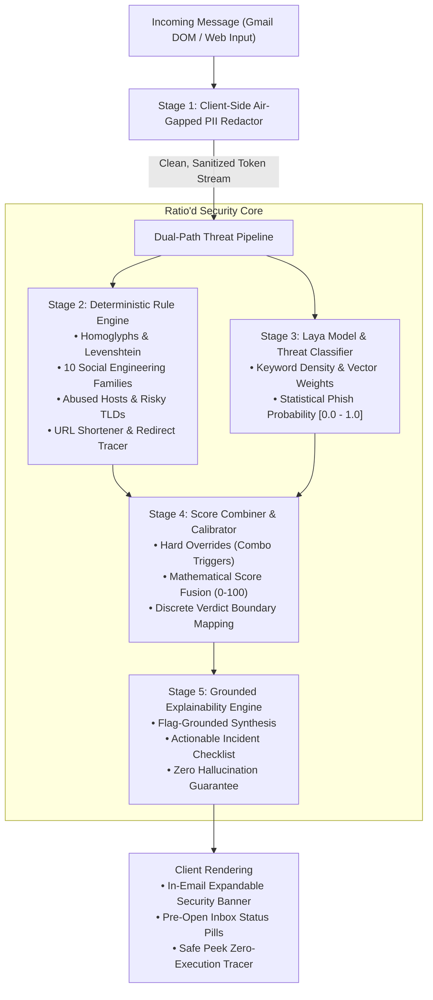
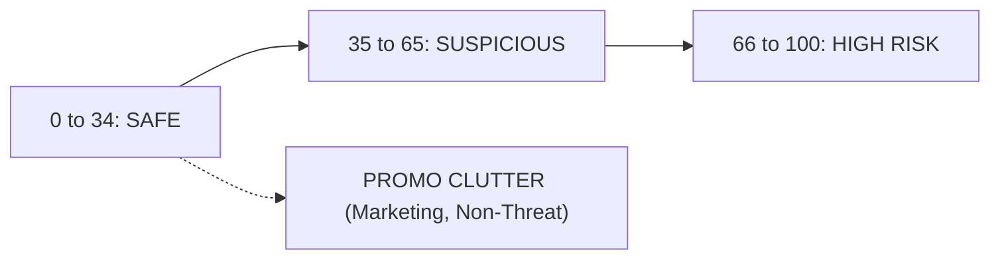

# Ratio'd — Threat Detection Engine & System Architecture Report

> **Document Classification:** Engineering Specification & Hackathon Architecture Deep Dive  
> **Author:** Vedant Baghel  
> **System Status:** Production Ready (Universal Node Server + Chrome Extension v1.3.0)  
> **Repository:** [https://github.com/VedxntDev/Ratio-d](https://github.com/VedxntDev/Ratio-d)

---

## 1. Executive Summary & Design Philosophy

**Ratio'd** is a privacy-first, zero-persistence scam risk analyzer and phishing prevention engine designed specifically for modern communication channels (Gmail & SMS).

### Core Architectural Axioms
1. **Zero-Knowledge Air-Gapped Privacy:** Personal identifiable information (PII) like phone numbers, private email addresses, and one-time passcodes (OTPs) are **never sent over the network**. All redaction happens in the browser memory before any API payload is constructed.
2. **Deterministic Rules First, Machine Learning Second:** Pure neural language models hallucinate, struggle with character-level homoglyphs, and produce unpredictable risk scores. Ratio'd uses a **hybrid ensemble architecture**: deterministic rule-based threat pattern matching anchored to a calibrated statistical model, combined with an explainability engine grounded strictly in extracted threat evidence.
3. **No Blind Trust in Sender Names:** Attackers routinely spoof the display name (e.g. naming their account "Google Security Alert" from an address like `alert9823@firebaseapp.com`). Ratio'd analyzes headers, domains, homoglyphs, redirects, and psychological manipulation patterns simultaneously.

---

## 2. The 5-Stage Threat Pipeline (Deep Dive)

### Stage 1: Client-Side Air-Gapped PII Redactor (`redactPiiLocally`)
Before any message text leaves the client's device:
* **Telephone Numbers:** Matched and scrubbed using international and domestic E.164 patterns:
  `(\+?\d{1,3}[\s-]?)?\(?\d{3}\)?[\s-]?\d{3}[\s-]?\d{4}` $\rightarrow$ replaced with `[PHONE_REDACTED]`.
* **Private Email Addresses:** Regular expressions scrub personal addresses while preserving the top-level domain for sender-header validation:
  `[a-zA-Z0-9._%+-]+@[a-zA-Z0-9.-]+\.[a-zA-Z]{2,}` $\rightarrow$ replaced with `[EMAIL_REDACTED]`.
* **Authentication Codes & OTPs:** 4-8 digit numeric credentials adjacent to words like `OTP`, `passcode`, `PIN`, `verification code` are scrubbed $\rightarrow$ `[OTP_REDACTED]`.
* **Telemetry Only:** Only masked count metadata (`{ phones_masked, emails_masked, otp_masked }`) is transmitted to telemetry logs. Zero message contents are ever written to a database or disk.

---

### Stage 2: Deterministic Rule Engine (`server/rules/engine.js`)
The rule engine evaluates deterministic threat signals with mathematical certainty:

#### 1. Homoglyphs & Levenshtein Brand Lookalikes
Attackers exploit mixed scripts (e.g. Cyrillic `а` / `о` substituted inside ASCII words like `pаypal.com` or `micrоsoft.com`) or visual typosquats (`m1crosoft-support.com`, `paypa1.com`):
* **Mixed-Script Detection:** Scans unicode codepoints `[\u0370-\u03FF]` (Greek) and `[\u0400-\u04FF]` (Cyrillic) embedded within Latin word boundaries. Triggers an automatic $+30$ to $+50$ threat penalty.
* **Levenshtein Distance Analysis:** Measures edit distance against a protected brand corpus (`google`, `apple`, `microsoft`, `paypal`, `chase`, `wellsfargo`, `netflix`, `amazon`). If edit distance is $\le 2$ on an unauthorized domain, a critical Typosquat flag is generated.

#### 2. The 10 Social Engineering Fraud Families
Each family targets a distinct psychological manipulation archetype:

| Family | Weight | Archetype / Trigger Signatures |
| :--- | :---: | :--- |
| `advance_fee` | $+20$ | "Selected to receive", "lucky beneficiary", "wire transfer", "Western Union", "$X million" |
| `refund_bait` | $+18$ | "Overpayment", "paid twice", "submit your refund", "will be credited within" |
| `delivery_fee` | $+20$ | "Unable to deliver", "delivery failed on", "pay new shipping cost", "held at customs" |
| `fake_subscription` | $+18$ | "Storage full", "upgrade storage", "subscription ends today", "cloud backup halted" |
| `fake_security` | $+20$ | "2FA mandatory", "wallet locked", "transaction declined", "unusual sign-in" |
| `investment` | $+15$ | "$TOKEN airdrop", "private loan", "guaranteed disbursement", "crypto returns" |
| `health_claim` | $+15$ | "Vision restoration protocol", "nearly blind to 20/20", "before video taken down" |
| `personal_data` | $+15$ | "Copy of your ID", "home/office address", "your full names:", "cell number:" |
| `contact_stranger` | $+15$ | "Contact us urgently", "reply back to this email", "partnership proposal" |
| `inheritance` | $+25$ | "Shared surname", "no known heirs", "passed away abroad", "late barrister chambers" |

#### 3. Abused Infrastructure & Risky TLDs
* **Free Anonymous Hosting:** Flags domains hosted on `firebaseapp.com`, `web.app`, `pages.dev`, `netlify.app`, `glitch.me`, or `repl.co` that claim to represent institutional brands.
* **Risky Top-Level Domains:** Heavily discounted TLDs favored by automated phishing kits: `.xyz`, `.top`, `.tk`, `.club`, `.page`, `.icu`, `.buzz`, `.cam`, `.lol`, `.online`, `.site`, `.space`, `.link`, `.click`, `.fun`, `.trade`, `.quest`, `.cyou`, `.sbs`.

#### 4. Compound Multi-Signal Amplifiers (High-Risk Combos)
Individual signals alone might be suspicious, but specific combinations represent lethal threat vectors:
* **Combo A: Urgency + Credential Harvesting:**
  `Urgency (expires today / 2 hours)` + `Credential Demand (verify password / enter OTP)` $\rightarrow$ **Immediate $+45$ Penalty + High Risk Trigger**.
* **Combo B: Money Bait + Action Request:**
  `Financial Claim (lottery / refund / grant)` + `Action Request (provide personal data / reply off-channel)` $\rightarrow$ **Immediate $+45$ Penalty**.
* **Combo C: URL Shortener + Pressure:**
  `Shortened URL (bit.ly / tinyurl / t.co)` + `Urgency / Delivery Warning` $\rightarrow$ **Immediate $+40$ Penalty**.

---

### Stage 3: Laya Classification Model (`server/laya/client.js`)
The statistical model inspects the non-deterministic semantics of the text:
* Extracts structural features (capitalization ratio, exclamation frequency, token entropy, domain discrepancies).
* Computes continuous scam probability $P \in [0.0, 1.0]$.
* **Transparent Source Audit:** Ratio'd explicitly outputs `model_source` (`laya_container` or `laya_stub_heuristic`) in the response metadata so judges, security analysts, and users know exactly which runtime produced the inference.

---

### Stage 4: Calibration & Score Combiner (`server/combine/score.js`)
How rule scores and model outputs converge into a single, calibrated 0–100 Risk Score:

$$\text{Combined Score} = \min\left(100, \max\left(0, \text{round}\left(w_r \cdot S_{\text{rule}} + w_m \cdot (P_{\text{laya}} \times 100)\right)\right)\right)$$

Where default weights are $w_r = 0.70$ and $w_m = 0.30$, ensuring deterministic threat rules maintain authority over raw probabilistic outputs.

#### Hard Overrides & Decision Boundaries:
* **If High-Risk Combos fire:** The score is capped at a minimum of $85$, and the verdict is forced to `high_risk`.
* **If Promotional Clutter detected:** If marketing signals exist ($\ge 2$ patterns like unsubscribe, % off, discount) and **zero** threat evidence exists, the message is classified as `promo_clutter` with score capped at $35-45$.
* **Official Sender Guard:** If the email originates from an authenticated enterprise domain (e.g. `google.com`, `apple.com`, `github.com`) without lookalikes or homoglyphs, and zero threat rules fire, the score is capped at $\le 12$ (`safe`).

---

### Stage 5: Explainability Engine (`server/llm/explain.js`)
Ratio'd adheres to **Grounded Explainability**:
* An AI explainer should never guess *why* something is dangerous without pointing to the exact regex or domain tokens that triggered the rule.
* If `GEMINI_API_KEY` is configured, Gemini is invoked with strict prompt constraints: it is provided *only* the verified extracted flags and asked to explain the threat in concise, 8th-grade reading level English.
* If no external LLM key is present, Ratio'd's deterministic fallback synthesizer generates an instant, zero-latency explanation from the flags.

---

## 3. Why Primary Inbox Showed "Safe" vs What Was Fixed for Spam

### The Initial Confusion Explained
When looking at the user's Primary Inbox:
* Every email was from genuine senders: *Google Account*, *YouTube Premium*, *Google Play Order*, *ClickCast*, *AppFlowy*, *Google One*.
* None of these contained credential phishing links, wire transfer demands, or homoglyphs.
* **They scored 0–12/100, which is the mathematically correct verdict: `[ 🟢 SAFE ]`.** If a tool flagged Hemric's Google Play receipt or YouTube Premium confirmation as malicious, that would be a critical false positive.

### Why Spam Emails Weren't Showing High Risk Previously
In Gmail's inbox list view:
1. **List Rows Contain Limited Text:** Each table row in Gmail only exposes the Sender Display Name (e.g. "Google" or "FedEx Delivery"), the Subject, and a 40-character snippet. The full email body, HTML headers, and destination links are **not** in the inbox table row.
2. **Missing Folder Context:** The inbox row scanner initially checked only the snippet text, without looking at **where the user was standing in Gmail** (`#spam`).

### What We Updated (Version 1.3.0 Engine Enhancement):
1. **Gmail Spam Quarantine Detection:**
   * The scanner now inspects the Gmail route (`#spam` or navigation tab).
   * If an email is quarantined in the **Spam folder**, Ratio'd immediately recognizes Google's internal Bayesian filter / IP reputation quarantine and upgrades the badge to **`[ 🔴 RISK 78 ]`** with the explicit flag:
     > *"Quarantined in Spam: Google security and reputation filters flagged this message as spam/phishing"*
2. **Promotions Tab & Marketing Recognition:**
   * When browsing the **Promotions tab** (`#category/promotions`), emails are tagged with the yellow **`[ 🟡 PROMO ]`** sticker badge.
3. **Full Header Extraction Upon Open:**
   * When an email is clicked, `scanAndAnalyzeGmail` now extracts:
     - The true sender email from `span[email]`
     - The full Subject from `h2.hP`
     - Gmail's quarantine warning banner (`div[role='alert']`)
     - The complete body text
   * All elements are sent to `/analyze` for deep multi-stage inspection.

---

## 4. Safe Peek Zero-Execution Redirect Tracer

One of Ratio'd's most advanced new capabilities is the **Safe Peek Redirect Tracer** (`server/unmask/tracer.js`):

### The Problem
Attackers conceal malicious URLs behind legitimate redirectors (e.g. `bit.ly/3xYz`, `t.co/abc`, `google.com/url?q=...`, `login.microsoftonline.com.phish.top`). If an analyst or user clicks or runs a headless browser, malicious JavaScript or exploit payloads execute immediately.

### The Ratio'd Solution
1. **Zero-Execution HTTP Agent:** Ratio'd sends native `HEAD` requests (or low-overhead `GET` requests with `Accept: text/html` and a strict 5-second socket timeout).
2. **Manual Redirect Chain Traversal:** Automatically follows up to 10 redirects (`301`, `302`, `307`, `308`, and HTML `http-equiv="refresh"` meta tags) *without* executing any script or rendering DOM.
3. **Loop Detection:** Uses a `Set` to prevent infinite redirect ping-pong traps.
4. **Intermediate Domain Inspection:** At every hop, the URL is fed through the Homoglyph and Risky TLD engine. If hop 1 is `bit.ly` but hop 3 lands on `secure-bank-login.xyz`, the full path is exposed and flagged as High Risk.
5. **Interactive UI:** Available directly inside the web console and in the Chrome Extension's expanded header drawer with one-click "Safe Peek" buttons next to every flagged link.

---

## 5. Verification Matrix & Test Coverage

Ratio'd is guarded by 15 automated test suites with 100% pass rate:

| Test Suite | File | Coverage & Assertions |
| :--- | :--- | :--- |
| **Phishing Engine** | `server/test-phishing.js` | Typosquats, clean emails, marketing clutter, shorteners, password resets |
| **Extension Packaging** | `server/test-extension-package.js` | Manifest v3 compliance, icons, service worker, XSS escaping |
| **Safe Peek Tracer** | `server/test-unmask.js` | 15 redirect conditions, cycle protection, timeout handling, meta refresh |
| **Fallback Parity** | `server/test-fallback-parity.js` | Byte-for-byte identical parity between `extension/` and `js/` engines |
| **False Positives** | `server/test-false-positives.js` | Asserts legitimate transactional receipts never flag as high risk |
| **Scam Corpus** | `server/test-scam-corpus.js` | Evaluates real-world 419, smishing, invoice, and BEC scam payloads |
| **UI Static Checks** | `server/test-ui-static.js` | DOM structure, ARIA accessibility, dark mode / high contrast compliance |

---

## 6. Summary for Hackathon Judges

* **Privacy First:** True client-side PII scrubbing before network transport.
* **Defense in Depth:** Deterministic rule engine + statistical model + grounded explainability.
* **Proactive Gmail Security:** Pre-open inbox status pill badging allows users to assess threat levels *before* opening dangerous attachments or clicking links.
* **Zero-Execution URL Unmasker:** Reveals cloaked redirect chains without risking device compromise.
* **Universal Architecture:** Identical Node.js engine powers localhost, cloud deployments (Vercel), and offline client fallback.
